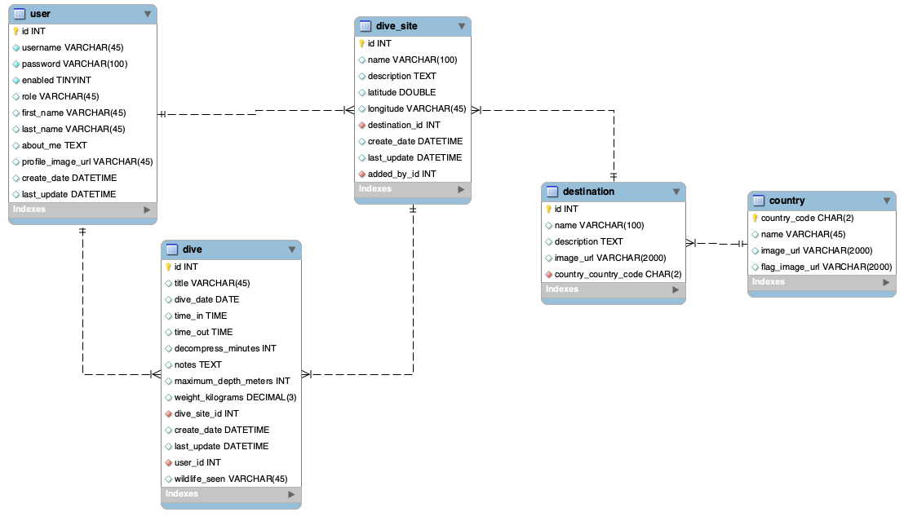

# EventTrackerProject

I created an online, multi-user SCUBA dive log application.  Users can enter dive destinations, specific dive sites, and record details of their individual dives.

### User stories:
* As a user, I can browse the site and see example log entries so I can understand the site.
* As a registered user I can log in so I can create and manage data.
* As a logged-in user I can retrieve a list of my dives.
* As a logged-in user I can retrieve any single dive to see its details.
* As a logged-in user I can add a new dive log entry so I can view it later.
* As a logged-in user I can update any of my dive log entries.
* As a logged-in user I can delete a dive log to correct a mistaken entry.
* As a logged-in user I can add a new dive destination so I can record nearby dive sites.
* As a logged-in user I can add a new dive site so I can record my dives there.
* As a logged-in user I can update a dive site so I can add and correct its details.

### Stretch goals
* As a user I can search dive sites by destination.
* As a user I can view dive log entries for a dive site.
* As a user I can view destinations by country.
* As a logged-in user I can view all my log entries on a map.
* As a logged-in user I can add photos to a dive log entry.
* As a user I can click on a log entry in the map to see the log details.

## Overview

This full-stack project implements a REST API using Spring and JPA.

I completed this project in three phases:
1. Database design and REST API.
2. Dynamic HTML and JavaScript front end using AJAX.
3. Dynamic Angular front end.

## Database Design and REST API

### Database:

#### Entities

I mapped the database tables and their relationships to Java entity classes.  Each entity was tested with JUnit, and each relationship (ManyToOne, OneToMany, ManyToMany) was tested with a JUnit test.

### REST API

The HTTP REST api stack includes:
* Spring Data JPA repositories, including derived query methods.
* A service layer (interface and implementation) to access the Spring Data JPA repositories and handle business logic.
* Spring `RestController` classes with request mappings to provide C.R.U.D. access to entity resources.

Sprint `RestController` request mappings provide the HTTP API endpoints.

#### REST Endpoints

| HTTP Verb | URI             | Request Body | Response Body | Status |
|-----------|-----------------|--------------|---------------|---------|
| GET       | `/api/dives`    |              | List of dives | 200   |
| GET       | `/api/dives/17` |              | Single dive   | 200 or 404 |
| POST      | `/api/dives`    | JSON of new dive       | JSON of created dive | 201 or 400 |
| PUT       | `/api/dives/17` | JSON for updating dive | JSON of updated dive | 200, 404, or 400 |
| DELETE    | `/api/dives/17` |              | | 204, 404, or 400 |

### Challenges and Lessons Learned

* Testing each entity, and each entity relationship, is essential.
* Controller logic MUST set appropriate HTTP status codes.
* Service-layer logic is the gatekeeper for the all-important data.

## Dynamic HTML and JavaScript Front End

* Coming Soon

### Challenges and Lessons Learned

## Dynamic Angular Front End

* Coming Soon

### Challenges and Lessons Learned
